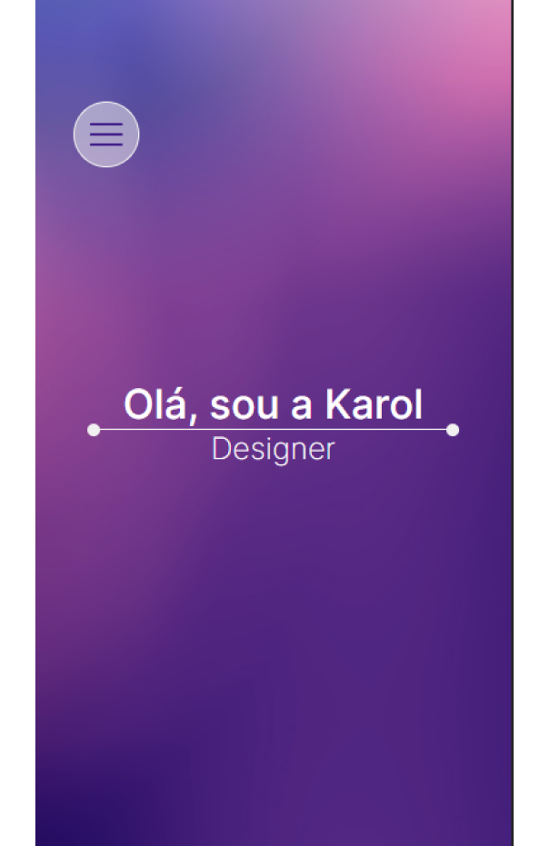
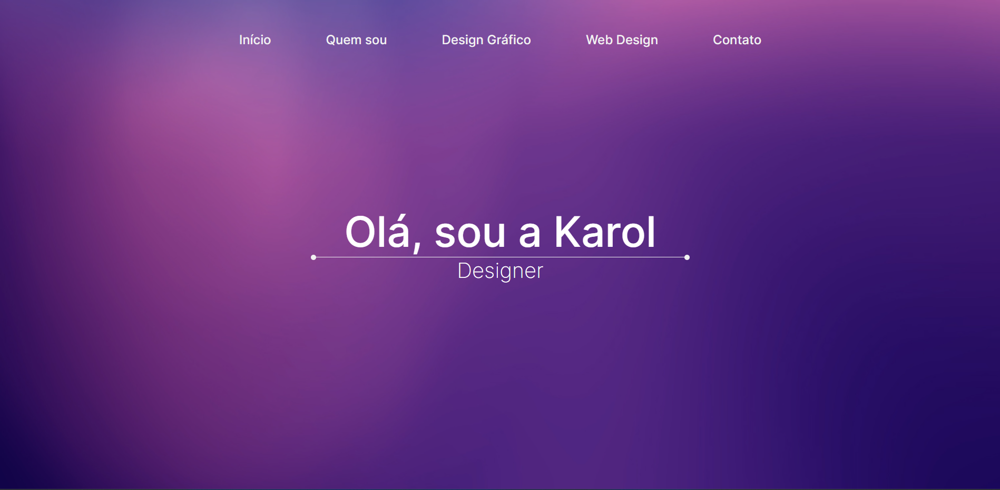

# Portfólios

  Portfólios com responsividade criados sob demanda utilizando React + Vite 
  <table>
      <thead>
        <tr>
          <th align="center">
             
            
 
              <small>
                Nome
              </small>
            

          </th>
          <th align="center"
             
            
 
              <small>
                Mobile Preview
              </small>
            

          </th>
          <th align="center">
             
            
 
              <small>
                Web Preview
              </small>
            

          </th>
        </tr>
      </thead>
      <tbody>
        <tr>
          <td align="center"><a href="portfolio-karol">Karoline Lemes Vaz</a></td>
          <td align="center">
            
          </td>
          <td align="center">
            
          </td>
        </tr> 
      </tbody>   
  </table>

